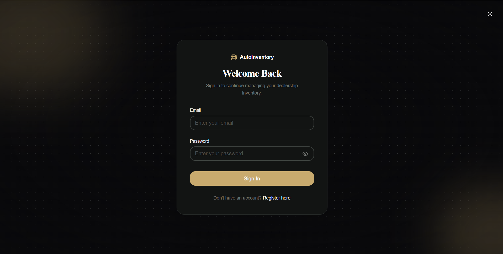
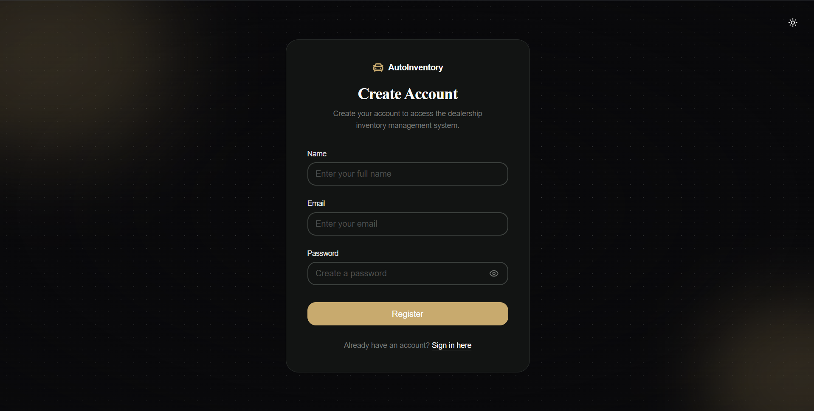
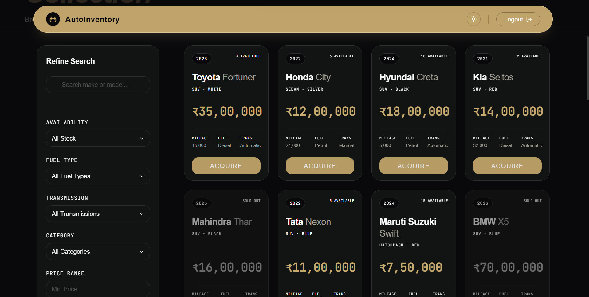
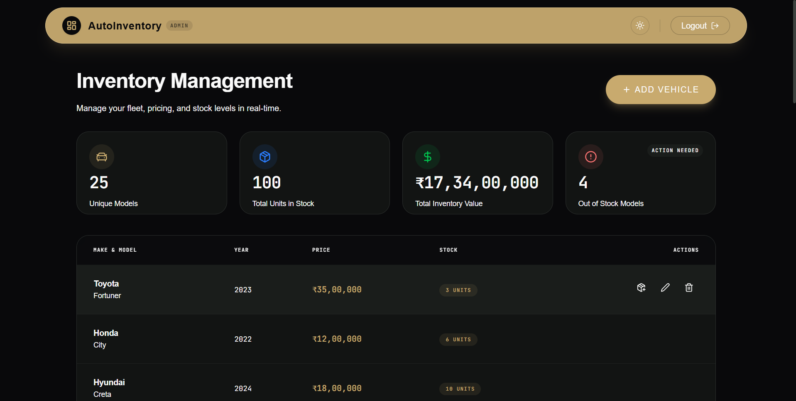
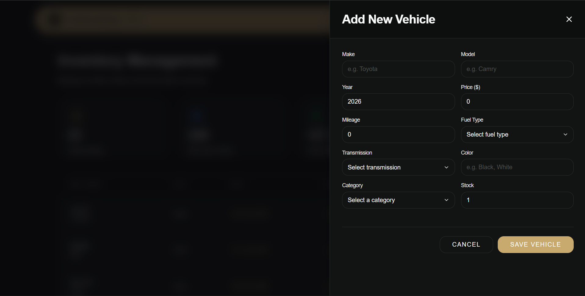
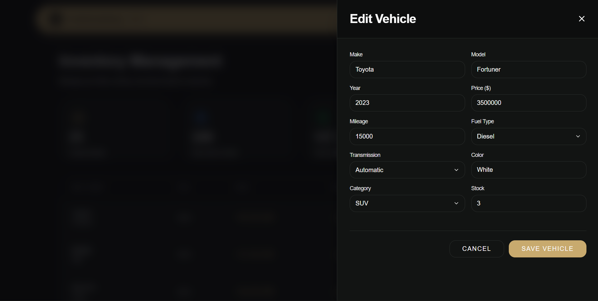
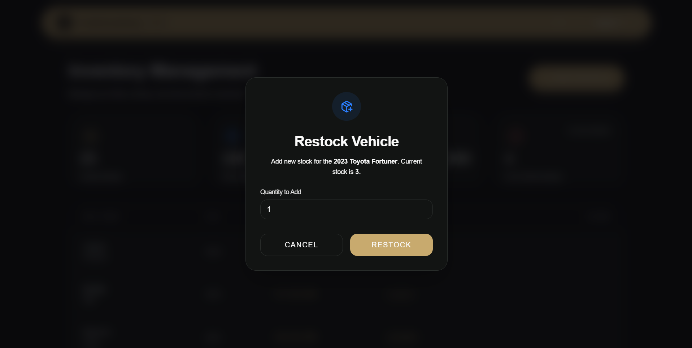
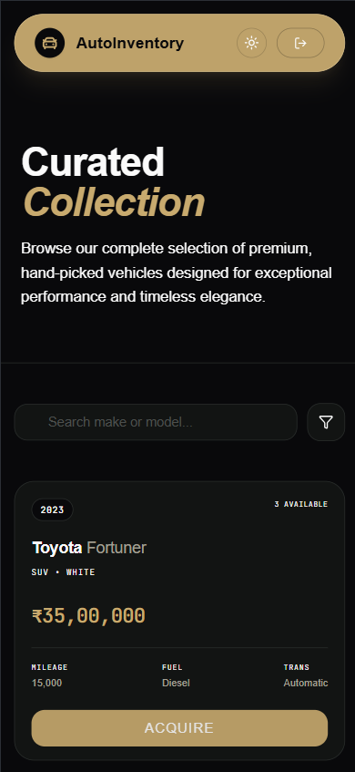

# Car Dealership Inventory System

A modern, full-stack Car Dealership Inventory Management System built as part of the Incubyte Software Craftsperson hiring assessment.

This application is designed to streamline dealership operations by providing a centralized platform for tracking and exploring vehicle inventory. It caters to two primary user roles:
- **Users**: Can browse the curated collection, utilize real-time search and filtering capabilities, and securely purchase vehicles.
- **Administrators**: Possess comprehensive, secure capabilities to manage the dealership fleet, including adding new models, restocking existing inventory, and maintaining accurate pricing and metadata through role-based access control.

---

## Live Demo

🚀 **[View Live Application Here](https://drive-stock-eight.vercel.app/login)**

- **Frontend**: Deployed on **Vercel**
- **Backend**: Deployed on **Render**

---

## Features

### Authentication

- User registration
- Secure login
- Password hashing using bcrypt
- JWT-based authentication
- Role-based authorization (User / Admin)

### Vehicle Management

- Create vehicle
- List all vehicles
- Search and filter vehicles
- Purchase vehicle
- Update vehicle (Admin)
- Restock vehicle (Admin)
- Delete vehicle (Admin)

### Testing

- Unit and integration tests using Jest and Supertest
- Test-driven development (TDD) approach followed throughout development

---

## Screenshots

### Login & Registration



### User & Admin Dashboards



### Vehicle Management




### Mobile Responsiveness


---

## Tech Stack

### Frontend
- **Framework**: React (via Vite)
- **Styling**: Tailwind CSS v4
- **Animation**: Framer Motion
- **Forms & Validation**: React Hook Form, Zod

### Backend
- **Framework**: Node.js, Express.js
- **Database**: MongoDB, Mongoose
- **Authentication**: JWT (jsonwebtoken), bcrypt
- **Testing**: Jest, Supertest

---

## Project Structure

```
├── client/                 # Frontend React Application
│   ├── src/
│   │   ├── components/     # Reusable UI components
│   │   ├── context/        # Global state management
│   │   ├── hooks/          # Custom React hooks
│   │   ├── layouts/        # Page layouts
│   │   ├── pages/          # Application views
│   │   └── services/       # API communication layer
│   ├── .env.example
│   └── package.json
│
├── server/                 # Backend Express API
│   ├── scripts/
│   │   └── seed_admin.js   # Administrator account seeder
│   ├── src/
│   │   ├── config/         # Database and app configurations
│   │   ├── controllers/    # Request handlers
│   │   ├── middleware/     # Auth and validation middleware
│   │   ├── models/         # Mongoose schemas
│   │   ├── routes/         # API endpoints mapping
│   │   ├── tests/          # Jest integration tests
│   │   ├── app.js          # Express app setup
│   │   └── server.js       # Server entry point
│   ├── .env.example
│   └── package.json
```

---

## Installation

Clone the repository:

```bash
git clone <repository-url>
cd <repository-directory>
```

### Backend Setup

Move to the backend directory and install dependencies:

```bash
cd server
npm install
```

Create and configure your environment variables:

```bash
cp .env.example .env
```

Update the values inside `server/.env`.

### Frontend Setup

Open a new terminal, move to the frontend directory, and install dependencies:

```bash
cd client
npm install
```

Create and configure your environment variables:

```bash
cp .env.example .env
```

Ensure the `VITE_API_BASE_URL` in `client/.env` points to your backend.

---

## Environment Variables

### Backend (`server/.env`)
```
PORT=5000                          # Port the server will run on
MONGODB_URI=your_mongodb_uri       # MongoDB connection string
JWT_SECRET=your_jwt_secret         # Secret key for signing JWTs
CORS_ORIGIN=http://localhost:5173  # Allowed origin for CORS (e.g., frontend URL)
NODE_ENV=development               # Environment context (development/production)
ADMIN_NAME=Admin                   # Seed administrator name
ADMIN_EMAIL=admin@example.com      # Seed administrator email
ADMIN_PASSWORD=secure_password     # Seed administrator password
```

### Frontend (`client/.env`)
```
VITE_API_BASE_URL=http://localhost:5000/api  # The base URL of the backend API
```

---

## Available Scripts

### Backend (`server/`)
- `npm run dev`: Starts the development server using nodemon.
- `npm start`: Starts the server using node (production ready).
- `npm test`: Runs the Jest test suite.
- `npm run seed:admin`: Seeds the default administrator account.

### Frontend (`client/`)
- `npm run dev`: Starts the Vite development server.
- `npm run build`: Compiles the application for production.
- `npm run lint`: Runs ESLint to check for code quality issues.

---

## API Overview

### Authentication

| Method | Endpoint | Description | Access |
|---------|----------|-------------|--------|
| POST | `/api/auth/register` | Register a new user | Public |
| POST | `/api/auth/login` | Login user | Public |
| GET | `/api/auth/profile` | View profile (Test route) | Authenticated |
| GET | `/api/auth/admin-only` | Admin access (Test route) | Admin |

### Vehicles

| Method | Endpoint | Description | Access |
|---------|----------|-------------|--------|
| POST | `/api/vehicles` | Create vehicle | Authenticated |
| GET | `/api/vehicles` | List vehicles | Authenticated |
| GET | `/api/vehicles/search` | Search & Filter | Authenticated |
| POST | `/api/vehicles/:id/purchase` | Purchase vehicle | Authenticated |
| PUT | `/api/vehicles/:id` | Update vehicle | Admin |
| POST | `/api/vehicles/:id/restock` | Restock vehicle | Admin |
| DELETE | `/api/vehicles/:id` | Delete vehicle | Admin |

---

## Authentication

Protected endpoints require a JWT.

```
Authorization: Bearer <token>
```

---

## Admin Account

Create the default administrator account using:

```bash
cd server
npm run seed:admin
```

The credentials are read from the `server/.env` variables:
- `ADMIN_NAME`
- `ADMIN_EMAIL`
- `ADMIN_PASSWORD`

---

## Running Tests

Move to the `server/` directory and run all tests:

```bash
cd server
npm test
```

The project currently includes automated tests covering:
- Application setup
- Authentication
- Vehicle management
- Authorization
- Inventory operations

---

## My AI Usage

### AI Tools Used
- Antigravity IDE

### How AI Was Used
AI was utilized as a development assistant throughout the creation of this assessment to accelerate the workflow without compromising architectural integrity. Key responsibilities included:
- **Architecture and Setup**: Discussing backend architecture decisions and generating initial boilerplate to establish a robust foundation.
- **Code Refactoring**: Reviewing and enhancing frontend code quality, particularly around React component structure, custom hooks, and strict naming conventions.
- **Implementation Polish**: Assisting with the implementation of a modern, responsive UI (Tailwind CSS and Framer Motion) and optimizing data endpoints (e.g., the debounced search/filtering API).
- **Deployment & Documentation**: Aiding in deployment readiness configuration (CORS, global error handling) and structuring professional documentation.

Every AI-generated solution was reviewed, thoroughly understood, and frequently manually modified to ensure it aligned perfectly with the assessment requirements before being committed.

### Reflection
The integration of AI into this development workflow significantly enabled faster iteration cycles. It served as a valuable sounding board for design decisions and provided excellent immediate code review. However, manual debugging, strict architectural validation, and final engineering decisions remained absolutely essential. While AI expedited execution, the core logic, security boundaries, and domain assumptions were actively steered by deliberate engineering choices.

**Note**: The prompts used throughout development are explicitly documented in `PROMPTS.md`.

---

## Assumptions

- Every registered user is assigned the `USER` role by default.
- Administrator accounts are created using the provided seed script.
- JWT is used for stateless authentication.
- Only administrators can perform inventory management operations such as update, restock, and delete.
- Purchase reduces available stock by one.
- Purchasing is not allowed when stock reaches zero.

---

## Future Improvements

Given additional time, the following enhancements could be considered:

- Pagination
- Sorting
- Advanced filtering
- API documentation (Swagger/OpenAPI)
- Docker Compose
- Rate limiting
- Request logging
- CI/CD pipeline

---

## License

This project was created solely for the Incubyte Software Craftsperson hiring assessment.
